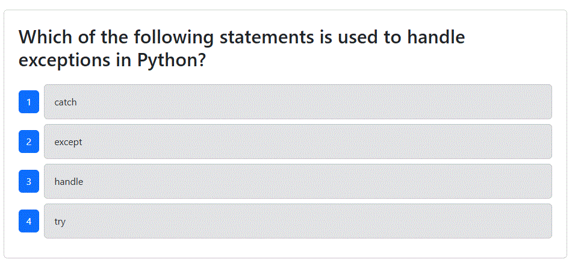

# TechQuiz

A simple quiz app which asks 10 random questions, created to demonstrate using Cypress to run tests on the components as well as end-to-end testing.

## Table of Contents

- [Installation](#installation)
- [Testing](#testing)
- [Demo](#demo)
- [Questions](#questions)

## Installation

Installation is performed using `npm i` from the root folder.

## Testing

To run tests, first build and seed using the commands `npm run build` and `npm run seed`. Once this is done, Cypress can be launched using the `npx cypress open` command to load the testing window. Both component and e2e (end-to-end) testing is configured and can be run.

## Demo

A demo video can be found here: https://www.youtube.com/watch?v=Sxsq2Dgem7U

## Questions

I can be reached with questions at https://www.github.com/Prelle or via email at p.elayne.terry@gmail.com.